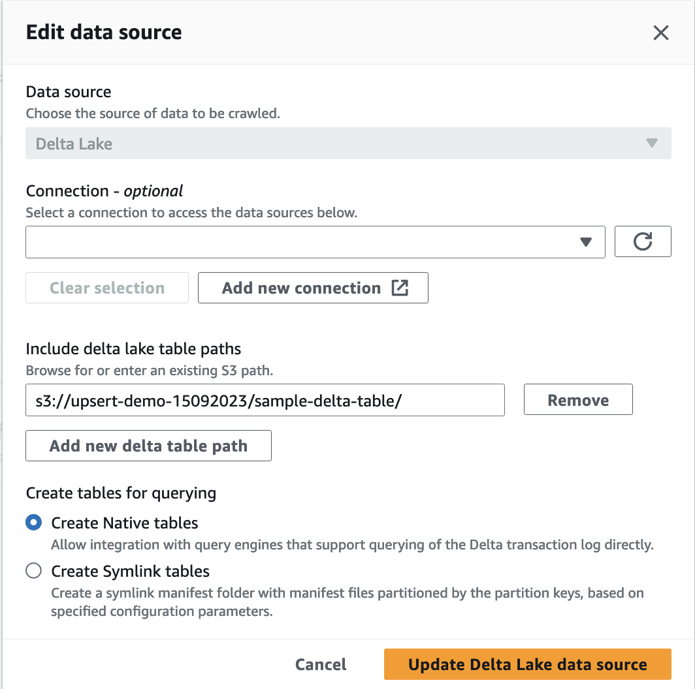
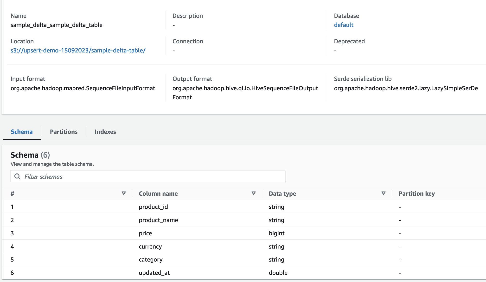
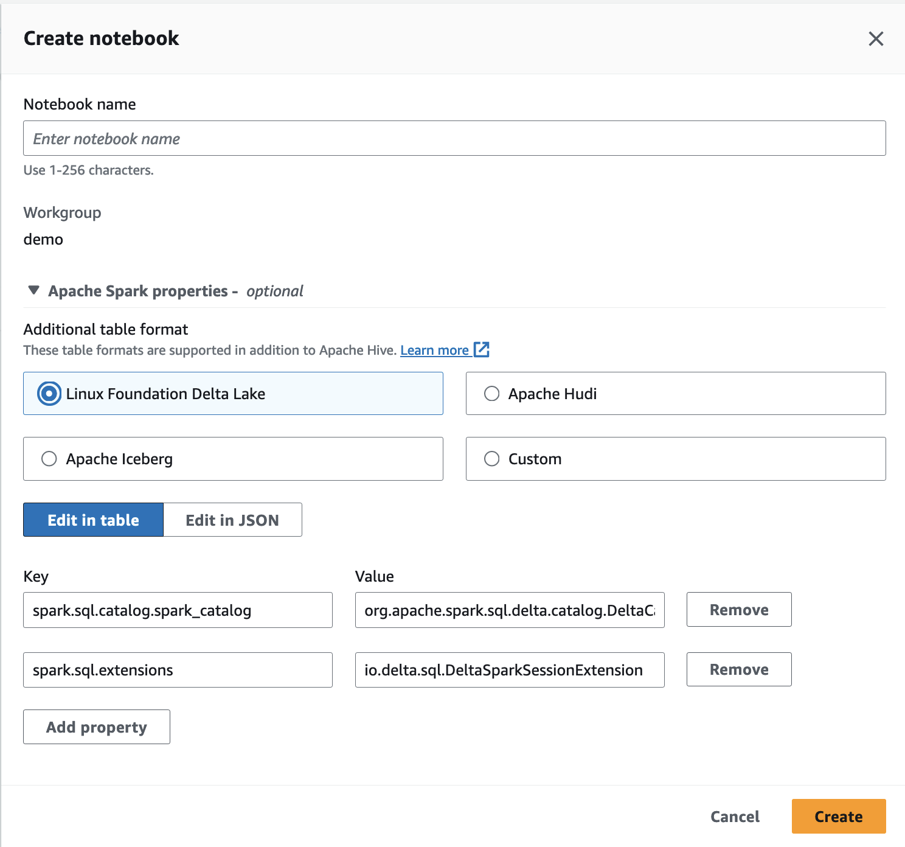

## Introduction

- Glue crawler crawl delta lake format
- Athena query delta lake format

## Data

Download sample data to a bucket

```bash
aws s3 sync s3://aws-bigdata-blog/artifacts/delta-lake-crawler/sample_delta_table/ s3://your_s3_bucket/data/sample_delta_table
```

Upload sample data from local data to a bucket

```bash
aws s3 cp . s3://BUCKET/sample-delta-table/ --recursive
```

## Crawler

Create a crawler to crawl the delta table, then can query using Athena as normal

</img>

When the crawl complete we see a new table in Glue Catalog

</img>

## Athena Notebook

It is possible to query the delta table using either Athena query editor or Spark notebook. For Spark notebook, first create a workgroup then create a notebook as below.

> [!IMPORTANT]
> Please select Linux Foundation Delta Lake option. Please ensure IAM role for the workgroup has perrmissions to read s3 and glue catalog.

> [!NOTE]
> Athena spark notebook already install delta lake packag

</img>

Let write simple notebook cells

```py
DB_NAME = "default"
TABLE_NAME = "sample_delta_sample_delta_table"
TABLE_S3_LOCATION = "s3://$BUCKET/sample-delta-table/"
```

and query using sql

```py
spark.sql("SELECT * FROM {}.{}".format(DB_NAME, TABLE_NAME)).show()
```

## Glue Notebook

It is possible to query and operate on the delta table from the Glue interactive notebook

> [!NOTE]
> Setup a proper IAM role for the Glue notebook (iam passroles)

first cell

```json
%glue_version 3.0
%%configure
{
  "--datalake-formats": "delta"
}
```

create spark session and or context

```py
%idle_timeout 2880
%glue_version 3.0
%worker_type G.1X
%number_of_workers 5

import sys
from awsglue.transforms import *
from awsglue.utils import getResolvedOptions
from pyspark.context import SparkContext
from awsglue.context import GlueContext
from awsglue.job import Job

sc = SparkContext.getOrCreate()
glueContext = GlueContext(sc)
spark = glueContext.spark_session
job = Job(glueContext)
```

then query using sql cell

```py
%%sql
SELECT * FROM `default`.`sample_delta_sample_delta_table` limit 10
```

## Delta Table Python

From the Glue notebook it is possible to import and use the DeltaTable lib

```py
from delta.tables import DeltaTable
```

Then do as normal

```py
df = DeltaTable.forPath(spark, "s3://upsert-demo-15092023/sample-delta-table/")
df.toDF().show()
```

> [!NOTE]
> We might need to create a spark session with below configuration to support Delta Lake

```py
spark = SparkSession \
.builder \
.config("spark.sql.extensions", "io.delta.sql.DeltaSparkSessionExtension") \
.config("spark.sql.catalog.spark_catalog", "org.apache.spark.sql.delta.catalog.DeltaCatalog") \
.getOrCreate()
```

## UPSERT Example

The full notebook is [HERE]("")

- Read fullload data csv in s3
- Write to a delta table in s3 (targat table)
- Read update data in csv (cdc updates)
- UPMERGE udpates into target

Let create new Glue notebook

```py
%glue_version 3.0
%%configure
{
  "--datalake-formats": "delta"
}
```

Create new session

```py
%idle_timeout 2880
# %glue_version 3.0
%worker_type G.1X
%number_of_workers 5

import sys
from awsglue.transforms import *
from awsglue.utils import getResolvedOptions
from pyspark.context import SparkContext
from awsglue.context import GlueContext
from awsglue.job import Job

sc = SparkContext.getOrCreate()
glueContext = GlueContext(sc)
spark = glueContext.spark_session
job = Job(glueContext)
```

Step 1. read fullload data (csv) from s3 into dataframe

```py
from delta.tables import DeltaTable
from pyspark.sql.types import *
from pyspark.sql.functions import col
from pyspark.sql.functions import expr

schema = StructType() \
      .add("policy_id",IntegerType(),True) \
      .add("expiry_date",DateType(),True) \
      .add("location_name",StringType(),True) \
      .add("state_code",StringType(),True) \
      .add("region_name",StringType(),True) \
      .add("insured_value",IntegerType(),True) \
      .add("business_type",StringType(),True) \
      .add("earthquake_coverage",StringType(),True) \
      .add("flood_coverage",StringType(),True)
```

Read fullload data from csv in s3

```py
# read the full load
sdf = spark.read.format("csv").option("header",True).schema(schema).load(f's3://{BUCKET}/fullload/')
sdf.printSchema()
```

Step 2. Then write delta table to s3

```py
# write data as DELTA TABLE
sdf.write.format("delta").mode("overwrite").save("s3://"+ BUCKET +"/delta/insurance/")
```

Step 3. Read update data from cdcload

```py
# read cdc update data
cdc_df = spark.read.csv(f's3://{BUCKET}/cdcload/')
```

Step 3. UPMERGE updates into the target

```py
# read fullload to dataframe from existing delta table
delta_df = DeltaTable.forPath(spark, "s3://"+ BUCKET +"/delta/insurance/")
```

and

```py
final_df = delta_df.alias("prev_df").merge( \
source = cdc_df.alias("append_df"), \
#matching on primarykey
condition = expr("prev_df.policy_id = append_df._c1"))\
.whenMatchedUpdate(set= {
    "prev_df.expiry_date"           : col("append_df._c2"),
    "prev_df.location_name"         : col("append_df._c3"),
    "prev_df.state_code"            : col("append_df._c4"),
    "prev_df.region_name"           : col("append_df._c5"),
    "prev_df.insured_value"         : col("append_df._c6"),
    "prev_df.business_type"         : col("append_df._c7"),
    "prev_df.earthquake_coverage"   : col("append_df._c8"),
    "prev_df.flood_coverage"        : col("append_df._c9")} )\
.whenNotMatchedInsert(values =
#inserting a new row to Delta table
{   "prev_df.policy_id"             : col("append_df._c1"),
    "prev_df.expiry_date"           : col("append_df._c2"),
    "prev_df.location_name"         : col("append_df._c3"),
    "prev_df.state_code"            : col("append_df._c4"),
    "prev_df.region_name"           : col("append_df._c5"),
    "prev_df.insured_value"         : col("append_df._c6"),
    "prev_df.business_type"         : col("append_df._c7"),
    "prev_df.earthquake_coverage"   : col("append_df._c8"),
    "prev_df.flood_coverage"        : col("append_df._c9")
})\
.execute()
```

## Validate

- Filter temporary dataframe
- Filter temporary table

Let create a temp dataframe from the delta table

```py
# read target table
delta_df = DeltaTable.forPath(spark, "s3://"+ BUCKET +"/delta/insurance/")
temp_df = delta_df.toDF()
```

Filter on dataframe

```py
temp_df.where("policy_id IN (100462, 100463, 100475)").show()
```

Create a temp table

```py
temp_df.createOrReplaceTempView("temp_view")
```

Query filter on the temp table

```py
spark.sql("SELECT * FROM temp_view WHERE policy_id IN (100462, 100463, 100475)").show()
```

## Glue Job

> [!NOTE]
> After interactive develop using Glue notebook, we can create a Glue ETL job to do full load and cdc update.

## Reference

- [UPSERT using delta and aws glue blog](https://aws.amazon.com/blogs/big-data/handle-upsert-data-operations-using-open-source-delta-lake-and-aws-glue/)

- [athena docs delta table](https://docs.aws.amazon.com/athena/latest/ug/delta-lake-tables.html)

- [delta lake table aws blog](https://aws.amazon.com/blogs/big-data/introducing-native-delta-lake-table-support-with-aws-glue-crawlers/)

- [athena spark installed libs](https://docs.aws.amazon.com/athena/latest/ug/notebooks-spark-preinstalled-python-libraries.html)

- [databricks merge example](https://docs.databricks.com/en/delta/merge.html#language-python)

- [delta lake merge](https://docs.delta.io/0.4.0/delta-update.html#merge-examples)
